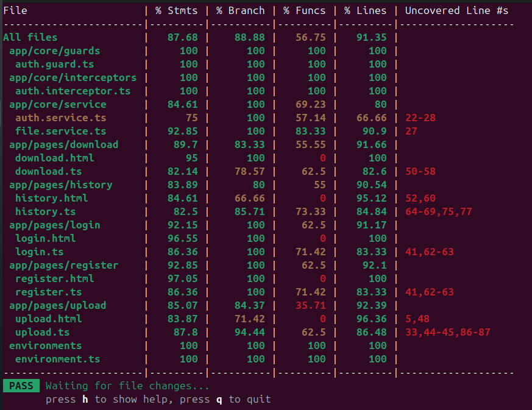

# TESTING.md — DataShare Frontend

## Plan de tests

| Fonctionnalité | Type de test | Fichier | Critères d'acceptation |
|---|---|---|---|
| Création de compte | Unitaire + Composant | `register.spec.ts`, `auth.service.spec.ts` | Formulaire valide → appel POST /api/register, redirection vers /login |
| Connexion utilisateur | Unitaire + Composant | `login.spec.ts`, `auth.service.spec.ts` | Formulaire valide → appel POST /api/login, redirection vers /upload |
| Upload de fichier | Unitaire + Composant | `upload.spec.ts`, `file.service.spec.ts` | Fichier sélectionné → appel POST /api/files, token retourné |
| Téléchargement via token | Composant | `download.spec.ts` | Token valide → métadonnées affichées, erreur si token invalide |
| Historique des fichiers | Composant | `history.spec.ts` | Liste chargée au démarrage, suppression retire le fichier de la liste |
| Suppression de fichier | Composant | `history.spec.ts` | Appel DELETE /api/files/{id}, fichier retiré de la liste |
| Guard d'authentification | Unitaire | `auth.guard.spec.ts` | Redirige vers /login si non connecté |
| Intercepteur JWT | Unitaire | `auth.interceptor.spec.ts` | Token ajouté dans le header Authorization si connecté |

## Instructions d'exécution

```bash
ng test
```

## Rapport de couverture

Seuil cible : **70%**  
Couverture obtenue : **91.35%**



### Détail par module

| Module | % Lignes |
|---|---|
| guards | 100% |
| interceptors | 100% |
| pages/login | 91.17% |
| pages/register | 92.1% |
| pages/upload | 92.39% |
| pages/history | 90.54% |
| pages/download | 91.66% |
| services | 80% |